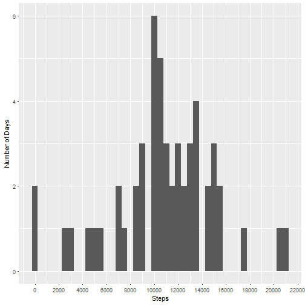

This R markdown file for the Coursera Reproducible Research course, project 1.  The data for this project and instructions were obtained by forking the file accessed by the following link:
[Project 1 files](https://github.com/rdpeng/RepData_PeerAssessment1).

##Read activity data into R Studio and load necessary packages to run the project code.


```r
activity<- read.csv("activity.csv", header = TRUE, stringsAsFactors = FALSE) 
library(tidyverse)  
```


#1. Determine total number of steps taken per day and show in a histogram


```r
activity %>%
     group_by(date) %>%
     summarise(steps = sum(steps)) %>%
     ggplot(aes(x=steps))+
     geom_histogram(binwidth = 500) +
     scale_x_continuous(name = "Steps", breaks = seq(0,30000,2000))+
     scale_y_continuous(name = "Number of Days", breaks = seq(0,10,2))
```

```
## Warning: Removed 8 rows containing non-finite values (stat_bin).
```



#### Calculate mean and median of the total number of steps taken per day


```r
summary<- activity %>%
     group_by(date) %>%
     filter(!is.na(steps)) %>%
     summarise(steps = sum(steps))%>%
     summarise(avg_steps = mean(steps), median_steps = median(steps))%>%
     print(summary)
```

```
## # A tibble: 1 × 2
##   avg_steps median_steps
##       <dbl>        <int>
## 1  10766.19        10765
```

#2. Determine the average daily activity pattern and create a time series plot representing the pattern


```r
act_pattern<- activity %>%
     group_by(interval) %>%
     filter(!is.na(steps)) %>%
     summarise(avg_steps = mean(steps))

ggplot(act_pattern, aes(interval, avg_steps)) +
     geom_line() +
     scale_x_continuous(name = "Time Interval", breaks = seq(0,3000,500))+
     scale_y_continuous(name = "Ave_Steps", breaks = seq(0,250,50))
```


#### Determine which 5 minute interval contains the max number of steps


```r
act_pattern[which.max(act_pattern$avg_steps), ]
```

```
## # A tibble: 1 × 2
##   interval avg_steps
##      <int>     <dbl>
## 1      835  206.1698
```

#3. Imputing missing values

#### Determine number of missing values in activity dataset

```r
sum(is.na(activity))
```

```
## [1] 2304
```

#### Create a new copy of the original dataset

```r
impute2<- activity
```

#### Create vector indicatings rows were NA values occur in the steps column

```r
ind<- which(is.na(impute2$steps))
```

#### Calculate average steps per interval in full dataset, removing NA values

```r
int_avg<- tapply(impute2$steps, impute2$interval, mean, na.rm = TRUE, simplify = TRUE)
```

#### Replace NA values with average for that specific interval

```r
impute2$steps[ind]<- int_avg
```

#### Check if NAs replaced

```r
sum(is.na(impute2))
```

```
## [1] 0
```

#### Create a histogram of frequency of steps with NAs replaced by average steps of the time interval

```r
impute2 %>%
     group_by(date)%>%
     summarise(steps = sum(steps))%>%
     ggplot(aes(steps)) +
     geom_histogram(binwidth = 500)+
     scale_x_continuous(name = "Steps", breaks = seq(0,30000,2000))+
     scale_y_continuous(name = "Number of Days", breaks = seq(0,10,2))
```


#### Summarize to determine if imputing values has impact compared to leaving NA values

```r
summary<- impute2 %>%
     group_by(date) %>%
     summarise(steps = sum(steps))%>%
     summarise(avg_steps = mean(steps), median_steps = median(steps))%>%
     print(summary)
```

```
## # A tibble: 1 × 2
##   avg_steps median_steps
##       <dbl>        <dbl>
## 1  10766.19     10766.19
```
#### Imputing the values has no effect in this example.

#4. Find the difference in activity pattern btw weekday and weekend

#### Create new data set identical to that created with imputed values

```r
by_dow <- impute2
```

#### Create new column 'Day' that indicates day of week

```r
by_dow$Day<- weekdays(as.Date(by_dow$date))
```

#### Substitue Day column entry with weekend or weekday

```r
by_dow$Day<- ifelse(by_dow$Day == "Saturday" | by_dow$Day == "Saturday", "weekend", "weekday")
```

#### Calculate average steps per interval for weekend and weekday entries

```r
ave_day<- aggregate(steps~interval + Day, by_dow,mean)
```

#### Create time series plot of average steps per interval for weekend and weekdays

```r
ggplot(ave_day, aes(interval, steps)) +
     geom_line() +
     facet_wrap(~ Day, ncol = 1)+
     scale_x_continuous(name = "Time Interval")+
     scale_y_continuous(name = "Ave_Steps")
```


